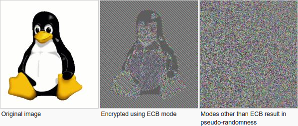

# cryptography-rsa-workshop

* references
    * https://stackoverflow.com/a/72461285
    * https://stackoverflow.com/questions/33105434/converting-a-base10-number-to-a-basen-number-using-a-custom-alphabet-of-size-n
    * https://gist.github.com/jasperdenkers/59cf5ad4acbba6b9d75d
    * https://crypto.stackexchange.com/questions/81495/rsa-is-there-a-way-to-digitally-sign-a-message-without-knowing-the-private-key
    * https://www.johndcook.com/blog/2019/03/06/rsa-exponent-3/
    * https://stackoverflow.com/questions/1967578/how-bad-is-3-as-an-rsa-public-exponent
    * https://crypto.stackexchange.com/questions/3608/why-is-padding-used-for-rsa-encryption-given-that-it-is-not-a-block-cipher
    * https://crypto.stackexchange.com/questions/22531/how-does-rsa-padding-work-exactly
    * https://www.encryptionconsulting.com/education-center/what-is-rsa/
    * https://www.comparitech.com/blog/information-security/rsa-encryption/
    * [Faster Primality Test - Applied Cryptography](https://www.youtube.com/watch?v=p5S0C8oKpsM)
    * https://en.wikipedia.org/wiki/Carmichael_number
    * [How To Tell If A Number Is Prime: The Miller-Rabin Primality Test](https://www.youtube.com/watch?v=zmhUlVck3J0)
    * https://blog.trailofbits.com/2019/07/08/fuck-rsa/
    * https://en.wikipedia.org/wiki/Carmichael_number
    * https://medium.com/@prudywsh/how-to-generate-big-prime-numbers-miller-rabin-49e6e6af32fb
    * [Cipher Block Chaining](https://www.youtube.com/watch?v=L4HaxfCRRs0)
    * [Encrypting with Block Ciphers](https://www.youtube.com/watch?v=oVCCXZfpu-w)
    * https://www.techtarget.com/searchsecurity/definition/cipher-block-chaining
    * https://en.wikipedia.org/wiki/Block_cipher_mode_of_operation

## disclaimer
* only for workshop purposes
    * for example: given implementation of RSA does not have padding

## preface
* goals of this workshop
    * introduction to asymmetric cryptography
    * mathematical basis for asymmetric cryptography
    * understanding purpose of trapdoor functions
    * introduction to RSA
        * common vulnerabilities
        * some basic attacks
    * basics of padding
    * basic knowledge of block ciphers
* structure
    * package cryptography
        * decryption/encryption
        * signing/signature verification
    * package key - to generate RSA key pair: private and public
    * package prime - generating primes
    * exploits are shown in RsaExploitsTest
* all used/needed math is described here: https://github.com/mtumilowicz/cryptography-math-basics

## asymmetric cryptography
* solve the problem of secure communications over an insecure network
* symmetric cryptography context
    * to exchange messages => first mutually agree on a secret key k
        * what if every communication is monitored?
            * is it possible to exchange a secret key?
                * first reaction: not possible
                    * reason: every piece of information is public
                * solution: public key (or asymmetric) cryptography
    * asymmetric ciphers - slower than symmetric ciphers
        * first use an asymmetric cipher to send the key to a symmetric cipher
        * then use symmetric key to transmit the actual file
* analogy
    * Alice: buys a safe with a narrow slot in the top and puts it in a public location
    * Bob: writes his message and slips it through the slot
    * Alice: only a person with the key to the safe can retrieve Bob’s message
    * summary
        * public key: the safe
        * encryption algorithm: putting the message in the slot
        * decryption algorithm: opening the safe with the key
* mathematical formulation
    * three sets
        * keys K
            * k = (kpriv, kpub) // private key and the public key
        * plaintexts M
        * ciphertexts C
    * for each kpub => exists encryption function e_kpub: M -> C
    * for each kpriv => exists decryption function d_kpriv: C -> M
    * (kpriv, kpub) e K => (d_kpriv) o (e_kpub) is identity on M
        * private key is sometimes called trapdoor information
            * it provides a trapdoor (shortcut) for computing the inverse function of e_kpub
                * it must be difficult to compute inverse function of e_kpub without a trapdoor
                information
    * encryption is a permutation of b-bit strings
        * {0, 1}^b -> {0, 1}^b
        * each key "chooses" some permutation

## trapdoor function
* is a function that
    * is easy to compute in one direction
    * believed to be difficult to find its inverse (without special information, called the "trapdoor")
* analogy: padlock and its key
    * it is trivial to change the padlock from open to closed without using the key
    * opening the padlock easily requires the key to be used
        * key is the trapdoor
* example
    * set some n, and define function as y = x^e mod n
        * bad trapdoor function
            * n = p (prime)
            * y = x^e mod p
            * we have to find inverse of e mod (p - 1)
                * Fermat's little theorem => we can perform calculations mod (p − 1) in the exponent
                * ed = 1 mod (p - 1)
                    * it is solvable (for example using extended Euclidean algorithm) if gdc(e, p-1) = 1
            * y^d = (x^e)^d = x^ed = x mod p
            * solution is unique
                * suppose that we have two solution c1, c2
                * c1 ≡ c1^de ≡ (c1^e)^d ≡ y^d ≡ (c2^e)^d ≡ c2^de ≡ c2 mod p
            * summary: very easy to reverse
        * good trapdoor function (rsa)
            * n = pq, p,q - prime
            * y = x^e mod n
            * we have to find inverse of e mod φ(pq)
                * Euler's theorem => we can perform calculations mod φ(pq) in the exponent
                * ed = 1 mod φ(pq)
                    * it is solvable (for example using extended Euclidean algorithm) if gdc(e, φ(pq)) = 1
                    * however, calculating φ(pq) is as hard as factoring pq
                * d - decryption exponent
                * e - encryption exponent
            * solution is unique
                * c1 ≡ c1^de ≡ (c1^e)^d ≡ y^d ≡ (c2^e)^d ≡ c2^de ≡ c2 mod n
            * if we know the actual factors, we can use Euler’s theorem and write x as
                * x = y^d mod n
                * ed = 1 mod (p-1)(q-1)

## rsa
* asymmetric encryption algorithm
* named after its inventors: Ron Rivest, Adi Shamir, and Leonard Adleman
* rsa = good trapdoor function explained above (product of two large prime numbers)
* encryption is faster if e is small and decryption is faster if d is small
    * most common e is 65537
* we are encrypting / decrypting numbers - not letters
    * example
        * encrypting: "hello"
        * observation: all of the information is already stored in binary
            * encoding standards like ASCII or Unicode are used for humans to understand
        * this means that "hello" already exist as number
* RSA relies on the size of its key to be difficult to break
    * longer RSA key => more secure it is
* prime generating problem
    * how to test a given number n for being prime?
        * maybe use Fermat’s little theorem?
            * take A: gcd(A,n) == 1
                * if A^(n−1) ≠ 1 mod n => then n is composite
                    * otherwise, it is prime with some probability
                    * repeat for many As to increase the likelihood of being prime
            * why it's wrong?
                * take n = 561
                    * this is composite number and fulfills Fermat's theorem for any A
                * family of such numbers are called Carmichael numbers
        * Miller Rabin primarity test
            * let p be an odd prime
            * p−1 = 2^k q, gcd(a,p)=1 => one of the following two conditions is true
                * a^q is congruent to 1 modulo p
                    * q = p-1 / 2^k
                * one of a^q, a^2q , a^4q ,..., a^2^(k−1)q is congruent to −1 modulo p
            * proof
                * n = 2^k * q + 1
                * a^(n-1) = 1 mod n
                * a^(n-1) - 1 = 0 mod n
                * (a^(n-1 / 2) - 1)(a^(n-1 / 2) + 1) = 0 mod n
                * (a^(n-1 / 4) - 1)(a^(n-1 / 4) + 1)(a^(n-1 / 2) + 1) = 0 mod n
                * (a^(n-1 / 2^k) - 1)(a^(n-1 / 2^k) + 1)*...*(a^(n-1 / 2) + 1) = 0 mod n
                    * we can expand it until n-1 / 2^k is odd
                * if n divides at least one multiplier => probably prime
                    * Euclid's lemma: if p prime <=> p|ab => p|a or p|b
                    * so we check this one by one
                    * each number in the list is the square of the previous number
                        * n-1 / 2^k, n-1 / 2^(k-1), n-1 / 2^(k-2)
            * if n is composite then running k iterations of the Miller–Rabin test will declare n probably
            prime with a probability at most 4^(−k)
                * proof
                    * Theorem 12.8
                    * https://math.mit.edu/classes/18.783/2017/LectureNotes12.pdf
            * prime number density
                * φ(n) is the number of prime numbers ≤ n
                * prime number theorem states that n / ln(n) is a good approximation of φ(n)
                * it means the probability that a randomly chosen number is prime is 1 / ln(n)
                    * there are n positive integers ≤ n
                    * approximately n / ln(n) primes
                    * n / ln(n) / n = 1 / ln(n)
                * probability to find a prime number of 1024 bits: (ln(2¹⁰²⁴)) = (1 / 710)
                    * primes are odd (except 2), we can increase this probability by 2
                    * to generate a 1024 bits prime number, we have to test 355 numbers randomly generated

## padding
* structure of a message can give attackers clues about its content
* padding: adding randomized data to hide the original formatting
    * using the word padding for RSA is by now rather incorrect
        * RSA without padding is also called Textbook RSA
    * old padding schemes for RSA did simply extend the message before converting a number
    * newer schemes actually alter the message itself as well
        * example: OAEP
            * entire message is randomly transformed before RSA modular exponentiation
            * the same message encrypted multiple times looks different each time
* padding oracles
    * adding padding to a message requires the recipient to perform an additional check
    whether the message is properly padded
    * when the check fails, the server throws an invalid padding error
        * that single piece of information is enough to slowly decrypt a chosen message
        * process is tedious and involves manipulating the target ciphertext millions of times
            * isolating the changes to get valid padding
        * that one error message is all you need to eventually decrypt a chosen ciphertext
            * it makes developing secure libraries almost impossible
            * padding oracle attack
                * will be described in other workshops
                * https://robertheaton.com/2013/07/29/padding-oracle-attack/
                * https://research.nccgroup.com/2021/02/17/cryptopals-exploiting-cbc-padding-oracles/
                * https://flast101.github.io/padding-oracle-attack-explained/
                * https://jiang-zhenghong.github.io/blogs/PaddingOracle.html

## block ciphers
* if block ciphers act on short blocks, how do we encrypt a long message?
    * electronic codebook mode (ECB)
        * encrypt each block separately
        * example
            * codebook
                * 00 -> 11
                * 01 -> 00
                * 10 -> 01
                * 11 -> 10
            * plaintext: 00|11|00|01|00
            * cipher:    11|10|11|00|11
        * cons
            * patterns
    * cipher block chaining (CBC)
        * each block of plaintext is XORed with the previous ciphertext block before being encrypted
        * cipher block chaining uses what is known as an initialization vector (IV) of a certain length
        * pros
            * decryption of a block of ciphertext to depend on all the preceding ciphertext blocks
* summary
    

## vulnerabilities
* TLS 1.3 no longer supports RSA
* criticism: https://www.youtube.com/watch?v=lElHzac8DDI
* using prime factorization, researchers managed to crack a 768 bit key RSA algorithm
    * recommendations: a minimum key length of 2048 bits now
        * many organizations have been using keys of length 4096 bits
* p and q must be globally unique
    * if p or q ever gets reused in another RSA moduli => can be easily factored using the GCD algorithm
* RSA primitive is based on modular exponentiation
    * this operation is homomorphic
    * c1=md1, c2=md2 => (m1*m2)^d=c1*c2=c
    * to fix it - it is the essential to break this "homomorphism"
        * padding
    * example: RsaExploitsTest "sign then verify - product attack"
* small exponent
    * for example: 3 // most common exponent is 65537
    * suppose you’re using a 2048-bit modulus N and exchanging a 256-bit key
        * message m is simply the key without padding => m³ < N => take the cube root
    * example: RsaExploitsTest "encode / decode - e < n"

## digital signature
* solves a problem analogous to the purpose of a pen-and-ink signature on a physical document
* assymetric cryptography vs digital signatures
    * consider an analogy: bank deposit vaults vs signet rings
        * in today’s world signet rings and wax images obviously would not provide much security
* digital signatures are at least as important as public key cryptosystems
* significant use-case
    * your computer receives program and system upgrades over the Internet
    * how can your computer tell that an upgrade comes from a legitimate source?
        * example: the company that wrote the program?
    * solution: digital signature
        * original program comes equipped with the company’s public verification key
        * company uses its private signing key to sign the upgrade
        * your computer can use the public key to verify the signature before installing it on your system
* it is quite inefficient to sign a large digital document D
    * it takes a lot of time to sign each b bits of D
    * resulting digital signature ~ as large as the original document
    * solution: use a hash function
        * hash: (arbitrary size documents) -> {0,1}^k
            * it should be very difficult to find D and D' whose hash(D) and hash(D') are the same
        * rather than signing document D sign the hash hash(D)
        * for verification: compute and verify the signature on hash(D)
* setup
    * the same as for RSA encryption
    * encryption
        * e = encryption exponent
        * d = decryption exponent
    * signing
        * d = signing exponent
            * sign document D by computing S ≡ D^d (mod N)
        * e = verification exponent
            * compute S^e mod N and verify that it is equal to D